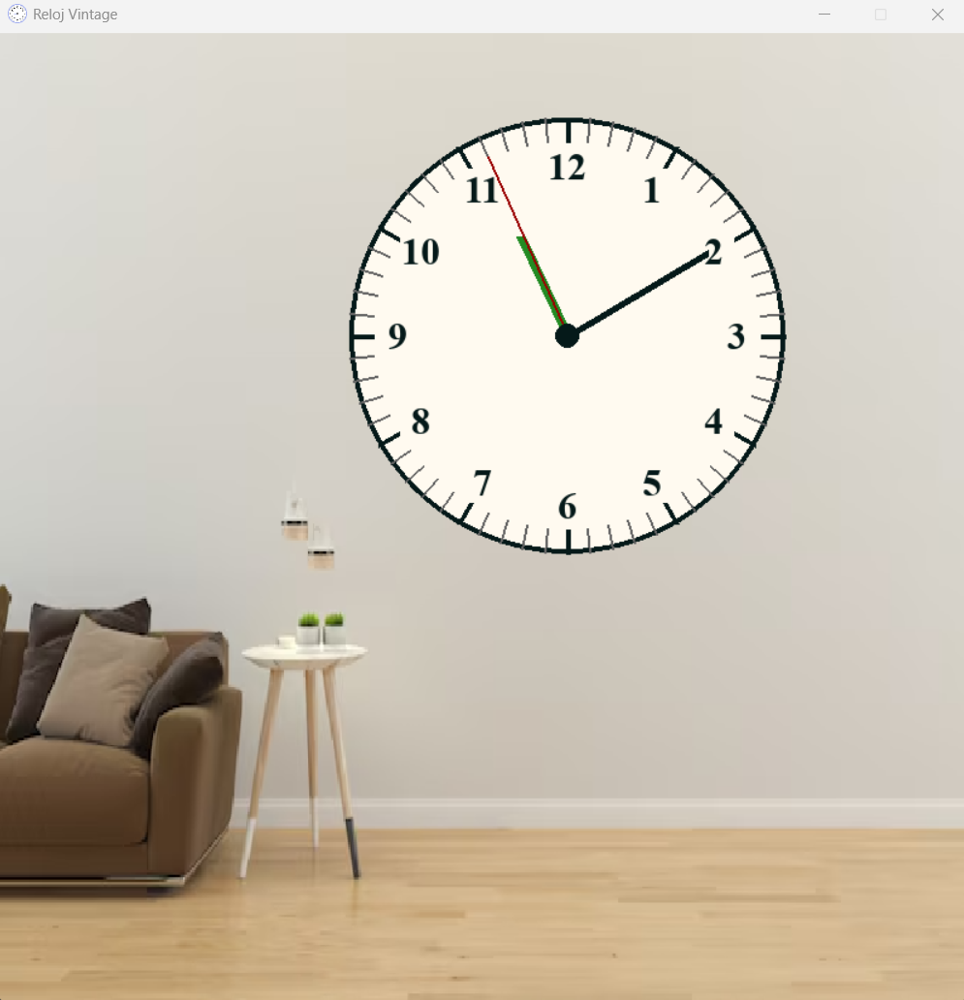

# 🕒 Reloj Analógico en Python

<p align="center">
  
  
  
</p>

---

## 📌 Descripción

Aplicación interactiva desarrollada en **Python** que representa un reloj en formato **analógico**.

El sistema se sincroniza automáticamente con la hora del sistema, pero también permite la **manipulación manual de las manecillas** mediante interacción con el mouse.

Al ajustar manualmente la hora, el reloj continúa su ejecución desde el nuevo valor definido. Además, puedes restablecer la hora actual presionando la tecla **`R`**.

---

## ✨ Características

- 🕐 Visualización analógica en tiempo real
- 🔄 Sincronización automática con la hora del sistema
- 🖱️ Interacción mediante arrastre de manecillas
- ⚙️ Modo manual persistente tras ajustes
- 🔁 Reinicio rápido a la hora actual (`R`)

---

## 🧠 Estructura de Datos

### 🔗 Lista Doblemente Enlazada Circular

El sistema implementa una **lista doblemente enlazada circular**, utilizada para modelar el comportamiento cíclico de los números del reloj.

---
## ⚙️ Requisitos

### 🐍 Python

Se requiere **Python 3.11.9**

---
##  📦 Instalacion de Python
🔗 Descarga oficial:  
https://www.python.org/downloads/release/python-3119/

---

### 💻 Instalación por sistema operativo
#### 🪟 Windows
Desde la powershell o cmd, ejecuta el siguiente comando / si no funciona ábrelo con permisos de administrador:

```bash
winget install Python.Python.3.11
```
Escribe en la barra de búsqueda "variables de entorno" y
selecciona la opción "Editar las variables de entorno del sistema".
En la ventana que se abre, haz clic en el botón "Variables de entorno". 
En la sección "Variables del Usuario o Sistema", busca la variable llamada "Path" y haz clic en "Editar". 

Deberia aparecer dos rutas como esta:

```bash
\AppData\Local\Programs\Python\Python311\Scripts\
```
```bash
\Users\Mao\AppData\Local\Programs\Python\Python311\Scripts\
```
Si no aparecen, haz clic en "Nuevo" y agrega ambas rutas, busca la ruta de instalación de Python 3.11 en tu sistema y
agrega las rutas correspondientes a "Path" en las variables de entorno.

---

Desde Homebrew usando el siguiente comando:
🍎 MacOS
```bash
brew install python@3.11
```
---

🐧 Linux (Ubuntu/Debian)
Desde la terminal, ejecuta el siguiente comando:
```bash
sudo apt-get install python3.11
```
---

## 🧩Librería que se utiliza: 
- pygame 
---

## 🛠️ Instalación 
- Clonar el reposorio 
---
## 🧑‍💻 Como Correr el Proyecto:

Una vez clonado abre la carpeta clock_project en un IDE de tu preferencia como: 
- Visual Studio Code 
- IntelliJ IDEA 
- PyCharm 
- etc

 ```
Tener en cuenta que la version de python previamente instalada debe estar agregado a las variables de entorno para poder ejecutar los siguientes comandos sin problemas.
```

---

## 🚶‍➡️Pasos Importantes: 
1. Abre la terminal integrada del IDE 
2. Instala el entorno virtual con el siguiente comando:

```bash
python -3.11 -m venv .venv
```
3. Activa el entorno virtual con el siguiente comando:


#### 🪟 Windows
```bash
.\.venv\Scripts\activate
```

#### En 🍎MacOS/ 🐧Linux

```bash
source .venv/bin/activate
```

4. Después de activar, instala las dependencias necesarias con el siguiente comando:
```bash
   pip install -r requirements.txt
 ```

5. El más importante, ejecuta el archivo main.py que se encuentra en La raiz de la carpeta del proyecto con el siguiente comando:

```bash
   python main.py
``` 
---

## 🖼️ Imagen del proyecto en ejecución:


---

## 👨‍🎓 Autor: 
- **Anderson Mauricio Ordoñez Zuñiga** 
---

## 🏫 Universidad:
- **Universidad Cooperativa de Colombia**
- **Campus Pasto** 
- **Facultad de Ingeniería** 
- **Programa de Ingeniería de Software** 
- **Semestre 2026-4** 
- **Curso: Estructuras de Datos** 
- **Profesor: Jhonatan Mideros** 
- **Fecha de entrega: 24/04/2026**

